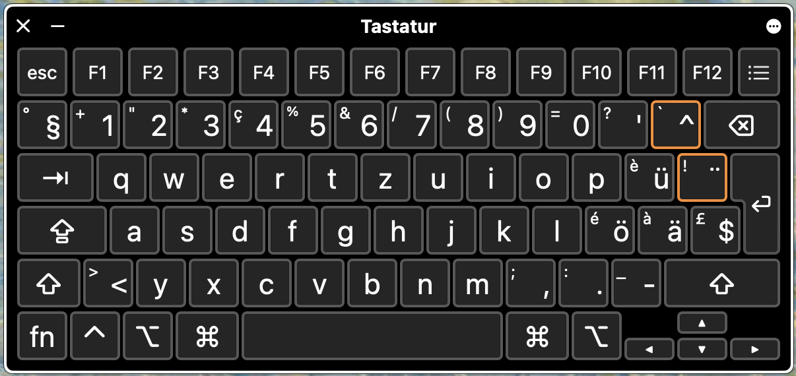
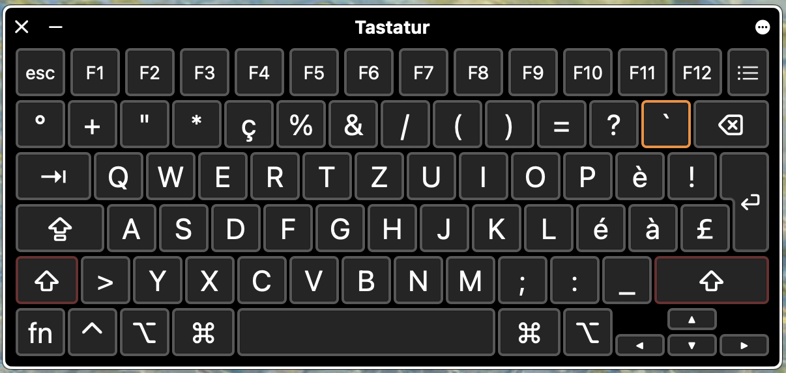
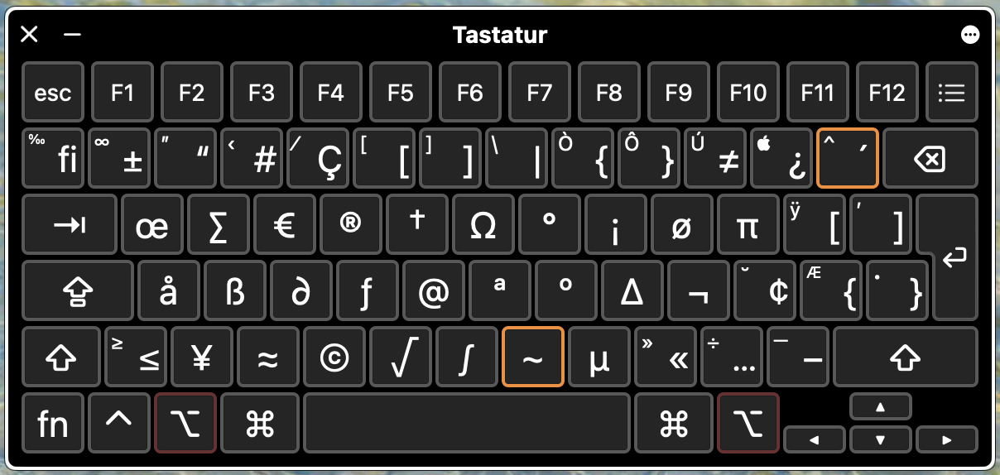
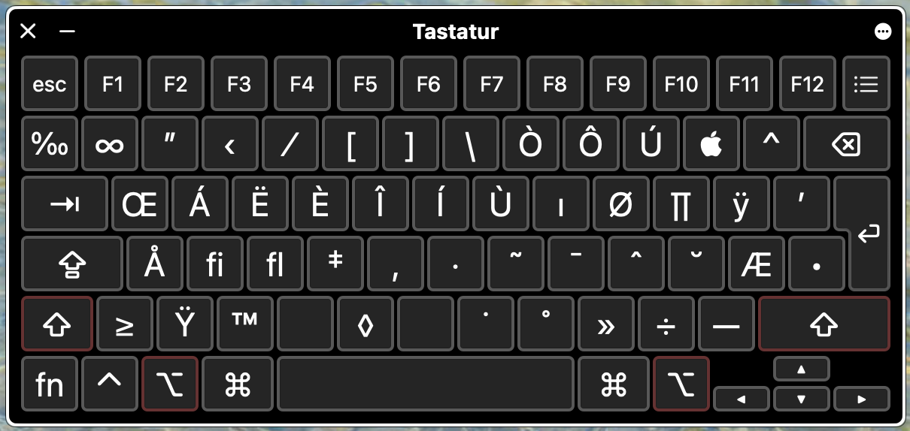

# custom keyboard layout

created following the guide in 
https://beebom.com/how-modify-or-create-custom-keyboard-layouts-mac/

Starting point: de_CH layout
switch Block of 4 keys:

ü ¨ ä $  ==> [ ] { } 

with the Option modifyer

## new layouts:
standard layout:

shift layout: 

option layout: 

shift option layout: 

windows layout for comparison: 
https://kbdlayout.info/KBDSG/

## Setup: 
- copy the `CH-mod.bundle` into `~/Library/Keyboard Layouts`
- install it in System Preferences->Keyboard->Input Sources (search for "CH mod", probably sorted in "others" category, not German)
- Log out, log in
- pick the custom layout in the input sources in the menu bar
- enjoy!

